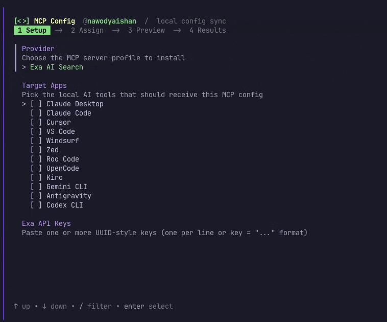

# Universal MCP Sync

[](https://github.com/nawodyaishan/universal-mcp-sync/releases)
[](https://github.com/nawodyaishan/universal-mcp-sync/actions/workflows/ci.yml)
[](./LICENSE)

<p align="center">
  
</p>

**Universal MCP Sync** (`usync`) is a local-first MCP configuration manager for developers who use multiple AI clients.

Configure an MCP server once, preview every file that would change, then sync native client config files for Claude Desktop, Claude Code, Cursor, VS Code, Windsurf, Zed, Roo Code, OpenCode, Kiro, Gemini CLI, Antigravity, and Codex CLI.

> [!IMPORTANT]
> **Help grow the supported MCP list.** If you maintain or rely on an MCP server, add it as a provider instead of documenting manual JSON edits. Start with [Adding an MCP Provider](docs/contributors/adding-a-provider.md), implement the `MCPProvider` contract, register it, and cover the client matrix with tests.
>
> Contributor baseline before a provider PR: `make fmt`, `make test`, and `make gitignore-check`. For provider/client compatibility changes, also run `make lint` and `make verify`.

## Supported MCPs

| MCP server | Capability | Transport | Auth shape | Status |
|---|---|---:|---|---|
| **Exa AI Search** | Web search and retrieval for agents | HTTP | API key in URL query | Stable |
| **Context7** | Current library docs and code examples | Streamable HTTP | `CONTEXT7_API_KEY` header | Stable |
| **GitHub** | Repository, issue, and PR workflows | Stdio via `npx` | `GITHUB_PERSONAL_ACCESS_TOKEN` env var | Beta |

The provider system is intentionally generic. New MCP servers are added through `MCPProvider`, then adapted per client through the capability matrix instead of branching the TUI or apply flow.

## Demo

<p align="center">
  
</p>

## Why This Exists

MCP client configuration is fragmented. Each AI client stores different JSON or TOML, uses different root keys, and handles transports differently. Manually copying credentials into those files is slow, hard to review, and easy to get wrong.

`usync` focuses on the native-config sync path:

- **One guided setup** for supported MCP servers and local AI clients.
- **Dry-run first** so users see exact target files, actions, and redacted credentials before writes.
- **Client-aware output** for `mcpServers`, `servers`, `context_servers`, `httpUrl`, `serverUrl`, TOML, and stdio bridges.
- **Local safety controls** with redaction, same-directory backups, atomic writes, rollback, and verification.
- **Provider architecture** for adding more MCP servers without special-casing the UI.

## Quick Start

### Install

macOS with Homebrew:
```bash
brew tap nawodyaishan/homebrew-tap
brew install usync
```

From source:
```bash
git clone https://github.com/nawodyaishan/universal-mcp-sync
cd universal-mcp-sync
make build
./bin/usync --help
```

Requirements for source builds:
- Go 1.23+
- macOS for full local client path detection

### Configure With The TUI

The TUI is the main provider-neutral workflow:
```bash
usync
```

If you built from source:
```bash
./bin/usync
```

The wizard lets you choose a provider, enter credentials, select target clients, preview the plan, and apply when ready.

### Preview And Apply From CLI

The current non-interactive CLI path supports Exa key files:
```bash
usync sync --keys-file ./exa_keys.txt --dry-run
```

Example redacted preview:
```text
MCP sync plan
=============
- Claude Desktop: Claude Desktop config
  credential: exa_****abcd
  path: ~/Library/Application Support/Claude/claude_desktop_config.json
  backup: .../claude_desktop_config.json.bak-exa-20260509-084228
```

Apply only after the preview is correct:
```bash
usync sync --keys-file ./exa_keys.txt --apply
```

## Supported Clients

`usync` detects and updates native config files for these macOS targets:

| Client | Config target |
|---|---|
| Claude Desktop | `~/Library/Application Support/Claude/claude_desktop_config.json` |
| Claude Code | Managed through `claude mcp` CLI when available |
| Cursor | `~/.cursor/mcp.json` |
| VS Code | `~/.vscode/mcp.json` |
| Windsurf | `~/.codeium/windsurf/mcp_config.json` |
| Zed | `~/.config/zed/settings.json` |
| Roo Code | `~/Library/Application Support/Code/User/globalStorage/saoudrizwan.claude-dev/settings/mcp_settings.json` |
| OpenCode | `~/.opencode.json` |
| Kiro | `~/.kiro/settings/mcp.json` |
| Gemini CLI | `~/.gemini/settings.json` and `~/.gemini/mcp_config.json` |
| Antigravity | `~/.gemini/antigravity/mcp_config.json` |
| Codex CLI | `~/.codex/config.toml` |

A dry run always shows the exact path on your machine before any write.

## How It Compares

Several MCP tools solve adjacent problems:

- [MCP Server Manager](https://github.com/sardine-ai/mcp-server-manager) and [mcp-manage](https://github.com/zarrx-dev/mcp-manage) use a gateway-style model where clients connect to one manager process.
- [MCP Router](https://github.com/mcp-router/mcp-router) provides a desktop management layer with projects, workspaces, and broad server connectivity.
- [vlazic/mcp-server-manager](https://github.com/vlazic/mcp-server-manager) centralizes MCP server/client config through a single YAML-backed manager and local web UI.

`usync` is intentionally different: it writes each AI client's native MCP configuration directly. That keeps the runtime path simple for users who want no always-on gateway, while still adding reviewability, credential redaction, backups, and rollback around local config edits.

## Safety Model

- **No writes by default**: Preview mode and the TUI review step show the plan first.
- **Credential redaction**: API keys, secret URLs, headers, env values, and generated args are redacted in user-facing output.
- **Atomic file updates**: Config files are written through the repo's backup/write path rather than ad hoc in-place edits.
- **Rollback on failure**: If an apply sequence fails after earlier writes, `usync` attempts to restore previous files.
- **Verification**: Tests cover provider output, client adaptation, JSON/TOML mutation, redaction, rollback, and scenario-level config shapes.

## Provider Architecture

```mermaid
flowchart LR
    user["User"] --> entry["TUI or CLI"]
    entry --> manager["pkg/app Manager"]
    manager --> registry["Provider Registry"]
    registry --> providers["MCP Providers<br/>Exa / Context7 / GitHub"]
    providers --> config["Provider MCPConfig<br/>transport + credentials"]
    config --> adapter["Client Adapter<br/>capability matrix + bridges"]
    adapter --> plan["Dry-run Plan<br/>redacted preview"]
    plan --> apply{"Apply?"}
    apply -- "no" --> stop["No files changed"]
    apply -- "yes" --> writers["Config Writers<br/>JSON / TOML / Claude CLI"]
    writers --> backup["Backup + Atomic Write"]
    backup --> clients["Native AI Client Configs"]
    clients --> verify["Verification"]
```



Every MCP server integrates through this interface:

```go
type MCPProvider interface {
	ID() string
	Name() string
	Description() string
	RequiredCredentials() []CredentialSpec
	GenerateConfig(credentials map[string]string) (MCPConfig, error)
}
```

Typical provider work:

1. Implement `pkg/provider/<name>.go`.
2. Register it in `DefaultRegistry()` in `pkg/provider/registry.go`.
3. Add transport support or bridge behavior in `pkg/client/`.
4. Extend JSON/TOML writers only when an existing format cannot persist the provider safely.
5. Add provider, redaction, client adaptation, config writer, and QA scenario tests.

See [Adding an MCP Provider](docs/contributors/adding-a-provider.md) for the full checklist.

## Go Library Usage

The core logic is available under `pkg/`. The API is pre-stable and may change before v2.0.

```go
import (
	"fmt"

	"github.com/nawodyaishan/universal-mcp-sync/pkg/app"
	"github.com/nawodyaishan/universal-mcp-sync/pkg/config"
	"github.com/nawodyaishan/universal-mcp-sync/pkg/provider"
)

func main() {
	manager, err := app.NewManager("/custom/home", nil, nil)
	if err != nil {
		panic(err)
	}

	prov := provider.NewContext7Provider()
	profiles := []provider.CredentialProfile{{
		ProviderID: prov.ID(),
		Values:     map[string]string{"CONTEXT7_API_KEY": "YOUR_SECRET_KEY"},
		Label:      "docs",
	}}

	selected := map[config.AppID]bool{config.AppCursor: true}
	assignments := map[config.AppID]int{config.AppCursor: 0}

	plan, err := manager.PrepareProvider(prov, profiles, selected, assignments)
	if err != nil {
		panic(err)
	}

	result, err := manager.Apply(plan)
	if err != nil {
		fmt.Printf("apply failed: %v\n", err)
	}
	fmt.Printf("updated %d targets\n", len(result.UpdatedTargets))
}
```

## Development

Requirements:
- Go 1.23+
- macOS for real local config path testing
- `golangci-lint` for `make lint`
- Lefthook is optional but recommended

Common commands:
```bash
make tidy          # sync module dependencies
make tidy-check    # verify go.mod/go.sum are already tidy
make fmt           # format Go sources
make vet           # run go vet
make lint          # run golangci-lint
make test          # run all tests with repo-local caches
make build         # build ./bin/usync
make verify        # run local CI guard
```

Install Git hooks:
```bash
brew install lefthook
lefthook install
```

## Contributing

Start with [CONTRIBUTING.md](CONTRIBUTING.md). Useful contributor docs:

- [Adding an MCP Provider](docs/contributors/adding-a-provider.md)
- [Dogfooding with Exa and Context7](docs/contributors/dogfooding-with-exa-context7.md)
- [QA and Usability Strategy](docs/roadmap/qa-usability-strategy.md)

Before opening a PR, run:
```bash
make fmt
make test
make gitignore-check
```

Run `make lint` and `make verify` when changing shared logic, release tooling, or provider/client compatibility.

## Documentation

- [Project Specification](docs/specification.md)
- [Sync Engine Design](docs/architecture/sync-engine-design.md)
- [Architecture Upgrade Plan](docs/specs/architecture-upgrade-plan.md)
- [Context7 Provider Spec](docs/specs/add-context7-provider.md)
- [Scalability and Plugin Research](docs/architecture/scalability-research.md)
- [Phase 2 Registry Wizard Roadmap](docs/roadmap/phase-2-registry-wizard.md)
